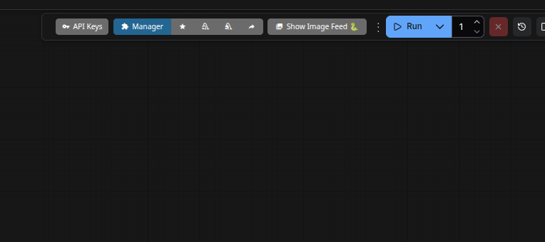
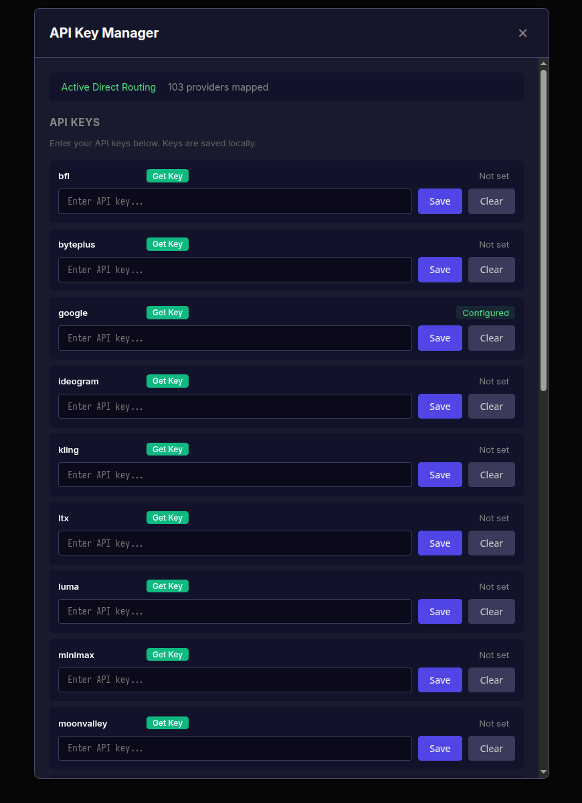

<div align="center">

# ComfyUI API Liberation

**Use your own API keys. Break the proxy. No middleman credits.**

[](https://opensource.org/licenses/MIT)
[](https://github.com/comfyanonymous/ComfyUI)

---

ComfyUI's built-in API nodes don't call vendor APIs directly. They route every request through
`api.comfy.org` — a proxy that replaces vendor pricing with its own opaque credit system.
You pay Comfy.org, Comfy.org pays the vendor. This is **API laundering**.

This extension removes the middleman entirely. Your calls go direct. Your keys, your rates, your data.

</div>

## What is API Laundering?

**API laundering** is the practice of wrapping third-party APIs behind a proxy service that
substitutes the original vendor's pricing and authentication with its own credit system.
The user never interacts with the actual provider — they buy proprietary credits from the
middleman, who then makes the real API call on their behalf, pocketing the margin.

The anatomy of an API laundry:

```
┌──────────┐     credits     ┌──────────────┐     real API key     ┌──────────┐
│   User   │ ──────────────> │  Middleman   │ ──────────────────>  │  Vendor  │
│          │ <─── response── │  (proxy)     │ <──── response ────  │  (API)   │
└──────────┘                 └──────────────┘                      └──────────┘
     pays markup                  keeps margin                    receives less
     loses transparency           obscures real cost              ToS may prohibit
```

This matters because:

- **Price opacity.** You can't compare what you're paying to what the vendor charges.
  The middleman sets credit prices arbitrarily with no obligation to track vendor rate changes.
- **Vendor ToS violations.** Many API providers explicitly prohibit reselling or proxying their
  services without authorization. The middleman may be operating in a legal grey area —
  or outright violating terms they agreed to.
- **Data routing.** Your prompts, images, and generated content pass through a third party that
  has no business seeing them. The vendor's privacy policy covered a two-party relationship;
  the middleman inserted a third.
- **Artificial dependency.** The software works without the proxy. The proxy exists to create a
  billing chokepoint, not to provide functionality. If the middleman goes down, raises prices,
  or changes terms, you lose access to APIs you could have called directly.
- **Regulatory exposure.** As API resale and data brokerage come under increasing regulatory
  scrutiny, intermediaries that repackage API access without clear licensing face growing
  legal risk — risk that propagates to their users.

API laundering is not "providing a service." Providing a service means adding value.
A proxy that strips your ability to use your own API key and replaces it with a credit meter
is extracting value. The distinction matters.

## Features

- **Direct API routing** — Calls go straight to vendor APIs, not through any proxy
- **No account needed** — Works without a ComfyUI/Comfy.org account
- **Local asset storage** — Images/videos stored locally instead of uploaded to intermediary servers
- **20+ providers supported** — All major AI APIs covered
- **Simple UI** — Configure keys through ComfyUI's interface
- **Graceful fallback** — If no key is set, falls back to default ComfyUI behavior

## Installation

```bash
cd ComfyUI/custom_nodes
git clone https://github.com/holo-q/comfy-api-liberation.git
```

Restart ComfyUI after installation.

## Configuration

### Option 1: UI (Recommended)

<div align="center">

**1.** Click **API Keys** in the toolbar



**2.** Enter keys for each provider



</div>

> **Get Key** links directly to each provider's API key page
> **Status** shows "Configured" (green) or "Not set"
> Keys are saved locally to `api_keys.json`

### Option 2: Environment Variables

```bash
export GOOGLE_API_KEY="your-key-here"
export OPENAI_API_KEY="your-key-here"
export STABILITY_API_KEY="your-key-here"
# ... etc
```

### Option 3: Config File

Create `api_keys.json` in the extension directory:

```json
{
  "google": "your-google-key",
  "openai": "your-openai-key",
  "stability": "your-stability-key"
}
```

**Priority:** Environment variables > Config file > UI settings

## Supported Providers

<table>
<tr>
<td width="33%" valign="top">

| Provider | |
|:---------|:-:|
| Google (Gemini, Veo, Imagen) | [Get Key](https://aistudio.google.com/app/apikey) |
| OpenAI (GPT, DALL-E, Sora) | [Get Key](https://platform.openai.com/api-keys) |
| Stability AI | [Get Key](https://platform.stability.ai/account/keys) |
| BFL (Flux) | [Get Key](https://api.bfl.ml) |
| Ideogram | [Get Key](https://ideogram.ai/manage-api) |
| Recraft | [Get Key](https://www.recraft.ai/docs) |
| Luma Labs | [Get Key](https://lumalabs.ai/dream-machine/api/keys) |

</td>
<td width="33%" valign="top">

| Provider | |
|:---------|:-:|
| Runway | [Get Key](https://dev.runwayml.com) |
| Kling AI | [Get Key](https://app.klingai.com/global/dev/api-key) |
| MiniMax | [Get Key](https://platform.minimax.io) |
| Pika | [Get Key](https://pika.art/api) |
| Tripo3D | [Get Key](https://platform.tripo3d.ai) |
| Rodin (Hyper Human) | [Get Key](https://hyperhuman.deemos.com/api-dashboard) |
| Topaz Labs | [Get Key](https://www.topazlabs.com/api) |

</td>
<td width="33%" valign="top">

| Provider | |
|:---------|:-:|
| BytePlus | [Get Key](https://console.byteplus.com) |
| PixVerse | [Get Key](https://platform.pixverse.ai) |
| Vidu | [Get Key](https://platform.vidu.com) |
| Moonvalley | [Get Key](https://www.moonvalley.com) |
| LTX Studio | [Get Key](https://ltx.io/model/api) |
| Wan (Alibaba) | [Get Key](https://www.alibabacloud.com/help/en/model-studio/get-api-key) |

</td>
</tr>
</table>

## How It Works

ComfyUI's API nodes send requests to `/proxy/*` endpoints on `api.comfy.org` — the laundry.
This extension intercepts that flow and routes it where it should have gone in the first place:

1. **Intercepts** outgoing API requests before they leave ComfyUI
2. **Rewrites** `/proxy/vendor/...` URLs to direct vendor API endpoints
3. **Injects** your API key as the appropriate auth header
4. **Virtualizes** the file upload system so assets stay on your machine

All of this happens transparently — existing workflows work without modification.
No nodes to replace, no workflows to rebuild. The proxy is simply removed from the equation.

## Debugging

```bash
LIBERATION_DEBUG=1 python main.py
```

## Security

- API keys are stored locally in `api_keys.json` (gitignored)
- Keys are never sent to ComfyUI/Comfy.org servers
- Each provider only receives its own API key
- Your data travels directly between you and the vendor — no third-party pass-through

---

<div align="center">

**MIT License** · Issues and PRs welcome

</div>
